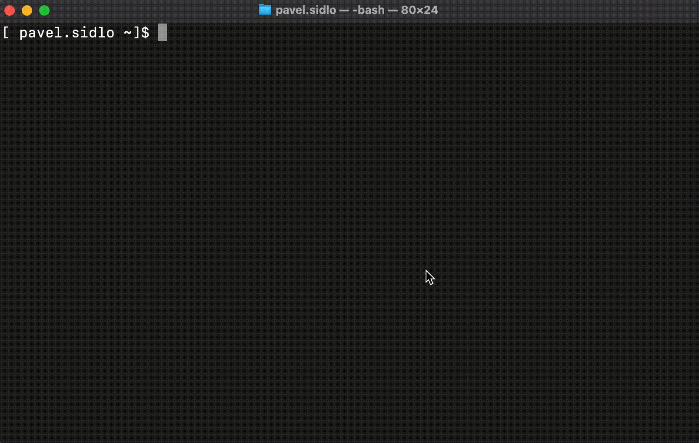

# Go Grab Module

Go Grab CLI allows you to download Go modules using keywords instead of remembering URLs. After searching and picking your module, CLI will automatically execute `go get <url>` command. 

### Download destination

The destination of downloaded modules will follow the rules of `go get` command which will depend entirely on your installed Go version, configuration, and environment.

Legacy GOPATH behaviour: https://pkg.go.dev/cmd/go#hdr-Legacy_GOPATH_go_get

Most common behaviour is:
1. update `go.mod` if exists
2. update `/vendor` if exists
3. update `$GOPATH/pkg`

### Install gograb

As a prerequisite you must set your GOPATH: https://github.com/golang/go/wiki/SettingGOPATH

For Go 1.17 and higher

`$ go install github.com/dyamon-cz/gograb@latest`

For Go 1.16 and lower

`$ go get -u github.com/dyamon-cz/gograb`

### gograb [module]

Simply use `$ gograb [key words]` to search for go modules, chose from the list and press enter.

